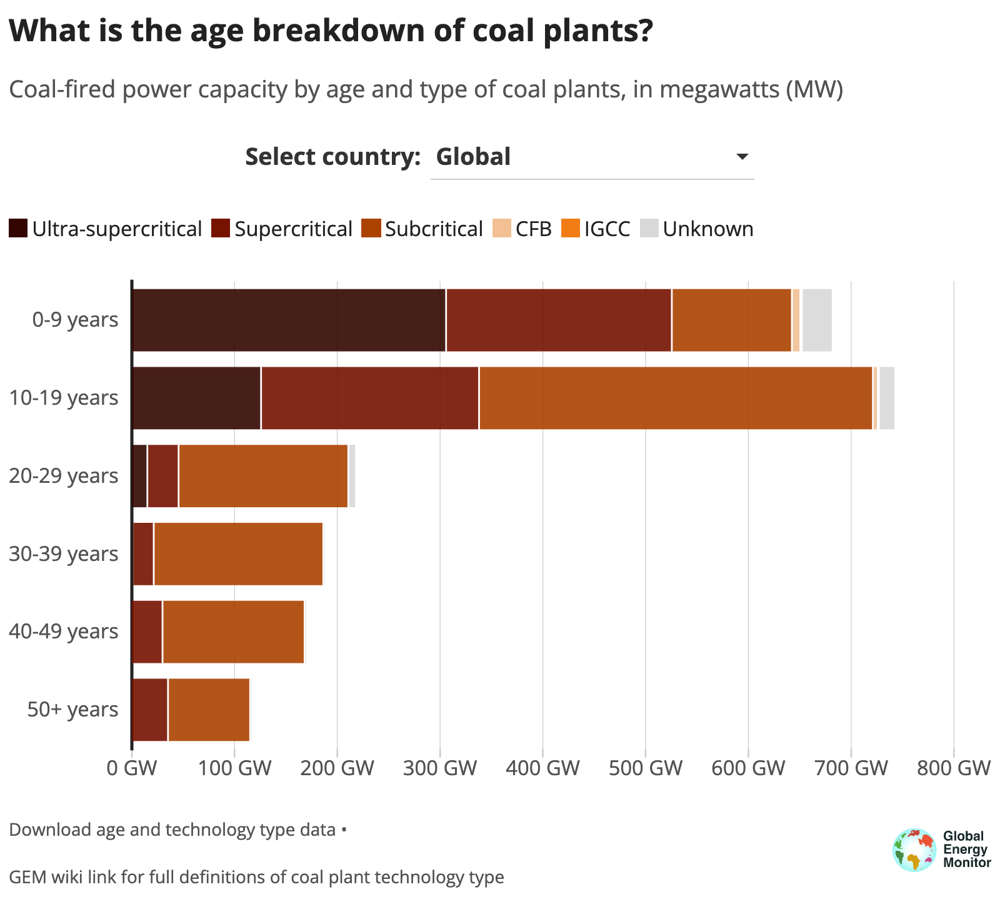

# Global Coal Plant Tracker dashboard

This repository hosts the code for the [Global Coal Plant Tracker dashboard](https://globalenergymonitor.org/projects/global-coal-plant-tracker/dashboard/), built using the [Flourish API dashboard template setup](https://github.com/GlobalEnergyMonitor/Flourish-API-dashboard-template). For the full instructions on how the Flourish API framework, you can go through the comprehensive README that includes all the different steps on how to set and configure a new dashboard in the template Github repo. This repo will focus on how to update and make changes to the coal plant tracker dashboard, which is updated with new data releases every six months. 

This README is split up into three different sections. The first section explains how each of the dashboard components are set up, with a snapshot of the data structure that make up each of the elements. The following two sections reflect the two different steps in the process of updating the dashboard. The first step takes the data provided by the GCPT project manager, makes some minor structural adjustments and saves it out it in the exact `.json` file format required for the dashboard. The second step focuses on making the changes to the dashboard itself, and making it live on the front end, once you have the new data ready. 

## How the GCPT dashboard is set up

The dashboard has been created using the Flourish API template, and is made up of:  
- a text summary, the summary phrase that provides a key fact about the country/region selected
- a "data ticker": the three large numbers and text that animates for every country/region selected
- four separate Flourish data visualisations  

It therefore has six different elements, each with its own data file and structure. Below we will go through the key details for each one, including the data structure each of these elements needs - however it is worth a very brief introduction into how the dashboard set up works and is updated, with the full details in the [Flourish API dashboard template setup README](https://github.com/GlobalEnergyMonitor/Flourish-API-dashboard-template). 

### Overview / How it works
There are a number of config files which control what the dashboard is showing. These can be found in `public/assets/`
* `page-config` describes what is in the whole page. Here you can specify the graphs in the page and the order they show, the tickers, the filtering type.
* `chart-config` contains the details for each chart - there are a number of config options needed, including a reference to the dataset and which keys in the data are being used where in the chart. There are optional additional config opotions, such as if the chart responds to filtering
* `text-config` this contains the text that appears outside the flourish graphics in the page - the title, any summaries etc.

**Things to note:**
* Datasets for each graphic are expected to live in `public/assets/data`
* The main page building blocks are `index.js`, `index.html` and `index.css`. A server can be found in `server.js` to handle the API requests to Flourish.
* The order of the countries in the dropdown is determined in the order the countries appear in the `text-config` data array. 
* Each of the dataviz except the data tickers has to be created and set up in Flourish, but the title and subtitle, as well as the actual data used in the version that shows up in the dashboard comes from the `chart-config.json` file and the relevant data files in this repo. 
* For your charts to work, the data header names in your data need to match with the names you assign to the variables in the `chart-config.json`. 
* In order for a chart to show up for a specific selection, the json file with data for that chart needs to include data for that chart, even if the totals are 0. If a country is not included in the data, when you select that country in the dropdown the chart will appear greyed out - so best to include data with 0s for each entry. 


## Update the dashboard: Quick guide

To make changes to the dashboard, you need to:
* change the data json files
* amend the relevant info in the config files (chart titles and subtitles or new filenames for your data if you are changing them)  
* change the summary text array in the `text-config.json` file - the order the countries appear in this file sets the order the countries appear in the dropdown
* make any text changes in other relevant config files (page title, dropdown text, footnote)  

*If adding a new datapoint, (eg a new year's data), you may also need to make some minor changes to the original Flourish links (such as changing the axis labels for example).*

**Datasets**
Any new data should be pushed to `public/assets/data` and be in `json` format. Each json file in the data folder is used in each of the elements that make up the page (data ticker numbers at the top and the four charts). 
* `gcpt_h1_2024_data_ticker.json`  
* `gcpt_h1_2024_cumulative.json`   
* `gcpt_h1_2024_added_retired_net_change.json`  
* `gcpt_h1_2024_status_over_time.json`  
* `gcpt_h1_2024_age_type.json`

If changing the filename of the data file, you will need to amend the value of the `dataset` variable in the `chart-config.json` document. If you make any changes to your data column names, you will need to change the relevant values in the chart config file, but if you replicate the 

**Summary text**
To update the summary text, you must do so in the `text-config.json` file. The order the countries appear here are the order they appear in the dropdown. Remember, a country must be included here to show up in the dropdown. Even if it is included in all the data files, if it is not listed in the text config file, it will not show up. 

**Other text**
All other text that is included in the page comes from either the text-config page (footnote and dropdown text for example) and the title comes from the index.html page. The chart title and subtitle text are defined in the `chart-config.json`, not the Flourish page. 

**Flourish changes**
For consistency, our x-axis labels in the Flourish charts with a timeseries (all except the age and technology type stacked bar chart) are being manually set in Flourish. So in order say to have 2024 as our axis label instead of H1 2024, we need to change this manually in the Flourish link.  

* [Cumulative capacity Flourish link](https://app.flourish.studio/visualisation/17172380/edit)  
* [Added, retired and net change column chart Flourish link](https://app.flourish.studio/visualisation/17172823/edit)  
* [Status over time stacked column chart Flourish link](https://app.flourish.studio/visualisation/17173772/edit)

**Data download links**
Each chart has a data download link at the bottom left. These files are updated manually - the new data first needs to be uploaded to the GEM Wordpress media library so that a link can be generated for them, and then that link should be updated in the `Footer` section of the respective Flourish link. 

**Putting your changes live**

Pushing your changes to the main branch on github should trigger an automatic rebuild on heroku and your changes should be reflected on the published dashboard almost instantly.

Below, you will find more detail about each element of the dashboard, the data structure for each and the full process into updating it with each release, including how to generate the datasets.   

## GCPT dashboard detail

### Element 1: Summary text


The summary text is optional for a dashboard, as well as it being possible to include summary text for some selections and not have any for others. Currently, this is how the GCPT is set up, with summary text for a few countries/groupings and no text for others. 

There is no Flourish ID or Flourish visualisation associated with the summary text, it is all included and set up in the `public/assets/text-config.json` file. 

Important to note however that even if you do not have any summary text, the text-config file needs to include the name of each of the dropdown/filter selections - while the **order they are in your text-config file will be the order of your dropdown**. 

**Data structure:**

``` 
[
    {
      "Country": "Global",
      "overall_summary": "Global operating coal power capacity has increased 11% since 2015."
    },
    {
      "Country": "BRICS",
      "overall_summary": "Operating coal power capacity in BRICS countries has increased 23% since 2015."
    },
    {
      "Country": "EU27",
      "overall_summary": "Operating coal power capacity in the 27 member states of the European Union (EU27) has fallen 34% since 2015.<br>Only a single coal-fired power station, in Poland, remains in development."
    },
    {
      "Country": "G7",
      "overall_summary": "The Group of Seven major industrial countries (G7) accounts for 14% of the world’s operating coal capacity, down from 23% in 2015.<br>The G7 no longer has any coal in construction, but is still home to one proposal in Japan and two in the United States."
    },
    {
      "Country": "G20",
      "overall_summary": "The Group of Twenty (G20) is home to 93% of the world’s operating coal capacity and 89% of coal capacity under consideration (in pre-construction stages)."
    },
    {
      "Country": "OECD",
      "overall_summary": "Operating coal power capacity in countries part of the Organisation for Economic Co-operation and Development (OECD) has fallen 26% since 2015.<br>Only four countries in the OECD, Australia, Japan, Türkiye, and the United States, are still considering coal projects."
    },
    {
      "Country": "Albania",
      "overall_summary": "Albania has no operating coal plants. It also has no coal power under development."
    },
    {
      "Country": "Argentina",
      "overall_summary": ""
    },
    ....
]
```

### Element 2: Data ticker  

  

Data tickers are also optional for a dashboard, as well as it being possible to choose the number of data points you want to display. Currently, the GCPT dashboard is set up with three key data points, which are:
- Operating coal power capacity
- Change in operating capacity from 2015
- Coal power capacity under development

The attributes for the tickers are customisable and are set within the `page-config` file, while the data and the colours for each of the text selections are set within the `public/assets/data/gcpt_data_ticker.json` file - the colours set in the config file are fallbacks in this case.  

The colours for the text, as well as the number of decimal places, are set in the data wrangling script and are based on the data value. For example in the change in operating capacity from 2015, if the value is negative (so a reduction in coal power capacity), the text colour is green, whereas if it is positive, indication an increase, the text colour is red. In terms of the decimal places, where the value is above 10 GW, it is rounded to the nearest whole number with no decimal places, where it is between 1 and 10, it is rounded to a single decimal places, where under 1 GW, it is rounded to two decimal places. 

**Data structure:**
```
[
  {
    "Country": "Global",
    "summary_1": "<span>{{2130}} GW</span><br>operating coal<br>power capacity",
    "summary_1_color": "#bf532c",
    "summary_2": "<span>{{578}} GW</span><br>coal power capacity<br> under development",
    "summary_2_color": "#f27d16",
    "summary_3": "<span>+{{217}} GW</span><br>operating coal power <br>capacity from 2015",
    "summary_3_color": "#761200"
  },
  {
    "Country": "Australia",
    "summary_1": "<span>{{22}} GW</span><br>operating coal<br>power capacity",
    "summary_1_color": "#bf532c",
    "summary_2": "<span>{{0.94}} GW</span><br>coal power capacity<br> under development",
    "summary_2_color": "#f27d16",
    "summary_3": "<span>{{-5.3}} GW</span><br>operating coal power <br>capacity from 2015",
    "summary_3_color": "#3F6950"
  },
  ....
]
```
Within the `chart-config.json` file, 

### Element 3: Cumulative capacity viz


The Flourish ID for this data visualisation is `17172380` and the link to the Flourish file is:  
https://app.flourish.studio/visualisation/17172380/edit 


**Data structure:**
```
[
  {
    "Country": "Global",
    "Year": "2000",
    "Capacity": "1068.1157"
  },
  {
    "Country": "Global",
    "Year": "2001",
    "Capacity": "1088.3054"
  },
  {
    "Country": "Global",
    "Year": "2002",
    "Capacity": "1108.6911"
  },
  ....
]
```

### Element 4: Additions and retirements viz


The Flourish ID for this data visualisation is `17172823` and the link to the Flourish file is:  
https://app.flourish.studio/visualisation/17172823/edit 

**Data structure:**
```
[
  {
    "Country": "Global",
    "Year": "2000",
    "Net change": "30.189",
    "Added": "34.25",
    "Retired": "-4.061"
  },
  {
    "Country": "Global",
    "Year": "2001",
    "Net change": "20.09",
    "Added": "21.693",
    "Retired": "-1.603"
  },
  {
    "Country": "Global",
    "Year": "2002",
    "Net change": "20.386",
    "Added": "24.584",
    "Retired": "-4.198"
  },
  ....
]
```

### Element 5: Status viz


The Flourish ID for this data visualisation is `17173772` and the link to the Flourish file is:  
https://app.flourish.studio/visualisation/17173772/edit 

**Data structure:**
```
[
  {
    "Country": "Global",
    "Year": "2015",
    "Retired": "-203.694",
    "Operating": "1913.152",
    "Mothballed": "2.606",
    "Construction": "317.824",
    "Permitted": "229.97",
    "Pre-permit": "416.869",
    "Announced": "530.893",
    "Shelved": "216.901",
    "Cancelled": "615.861"
  },
  {
    "Country": "Global",
    "Year": "2016",
    "Retired": "-241.578",
    "Operating": "1958.934",
    "Mothballed": "5.073",
    "Construction": "282.217",
    "Permitted": "133.167",
    "Pre-permit": "234.087",
    "Announced": "249.48",
    "Shelved": "568.921",
    "Cancelled": "885.147"
  },
  ....
]
```

### Element 6: Age and tech type viz


The Flourish ID for this data visualisation is `17223802` and the link to the Flourish file is:  
https://app.flourish.studio/visualisation/17223802/edit 

**Data structure**

```
[
{
    "Country": "Global",
    "Age group": "50+ years",
    "Ultra-supercritical": 0,
    "Supercritical": 35.2272,
    "Subcritical": 79.9461,
    "CFB": 0,
    "IGCC": 0,
    "Unknown": 1.202
  },
  {
    "Country": "Global",
    "Age group": "40-49 years",
    "Ultra-supercritical": 0,
    "Supercritical": 29.8873,
    "Subcritical": 138.2591,
    "CFB": 0,
    "IGCC": 0,
    "Unknown": 1.4362
  },
  {
    "Country": "Global",
    "Age group": "30-39 years",
    "Ultra-supercritical": 0.7,
    "Supercritical": 20.644,
    "Subcritical": 165.0263,
    "CFB": 0.165,
    "IGCC": 0,
    "Unknown": 0.9002
  },
  ....
]
```
## Updating the dashboard: step-by-step guide

### Step 1 - Update the data

With every data update, the GCPT project manger provides five spreadsheets, one for each of the elements that need updating as detailed above. The text summary file also needs to be updated with each dashboard update, but for the time being (as of July 2024), that is done manually and is not exported as part of the GCPT data update but created separately. 

The data wrangling to get the files into the exact specifications needed to upload to our dashboard can be done via the R scripts in the `data_wrangling` subfolder of this repo. 

The `run-all.R` file includes details of all the variables and scripts needed to run in order to do that, so following the steps and instructions there should be sufficient to get the data into the correct format before uploading to the dashboard. Basically the data is loaded into R in the scripts in the `R` subfolder, and formatted and exported in the scripts that are located in the `analysis` folder. 

Each of the steps in the R project takes the original `xlsx` file, loads it into R, does some very basic (for the most part) formatting and exports the files as `.json` files ready to be pasted into the dashboard `data` folder to replace the existing versions. The R scripts include detailed comments on what each element of the code does, in case this needs to be replicated. The only case where the exported data file is quite different to the imported one is the data tickers one, as the script sets certain conditions like if there has been an increase or decrease in capacity from 2015 to the latest year, to set the colour the text should be, as well as exporting decimal places for numbers below a threshold (explained in more detail above)

**Example data file input:**  

| Country/Region	| operating |	under_development	| change_in_operating_from_2015 |
|:-------|:----------|:-------------|:-----------------|
Albania	| 0 |	0	| 0 |
Argentina |	0.495 |	0.12 | 0.12 |
Australia	| 22.403| 0.945 |	-5.294 |


**Exported json file output:**
```
  {
    "Country": "Albania",
    "summary_1": "<span>{{0}} GW</span><br>operating coal<br>power capacity",
    "summary_1_color": "#bf532c",
    "summary_3": "<span>{{0}} GW</span><br>operating coal power <br>capacity from 2015",
    "summary_3_color": "#A8A8A8",
    "summary_2": "<span>{{0}} GW</span><br>coal power capacity<br> under development",
    "summary_2_color": "#f27d16"

  },
  {
    "Country": "Argentina",
    "summary_1": "<span>{{0.5}} GW</span><br>operating coal<br>power capacity",
    "summary_1_color": "#bf532c",
    "summary_3": "<span>+{{0.12}} GW</span><br>operating coal power <br>capacity from 2015",
    "summary_3_color": "#761200",
    "summary_2": "<span>{{0.12}} GW</span><br>coal power capacity<br> under development",
    "summary_2_color": "#f27d16",
  },
  {
    "Country": "Australia",
    "summary_1": "<span>{{22}} GW</span><br>operating coal<br>power capacity",
    "summary_1_color": "#bf532c",
    "summary_3": "<span>{{-5.3}} GW</span><br>operating coal power <br>capacity from 2015",
    "summary_3_color": "#3F6950",
    "summary_2": "<span>{{0.94}} GW</span><br>coal power capacity<br> under development",
    "summary_2_color": "#f27d16"
  },
  ....
```

Anyone updating the repo can follow the process set out in the scripts process by running the R code on their machine, updating the filepaths and data locations to match their own local filepaths - or if they prefer, can use any other method or programming language to create the final json files that are needed for the dashboard update - see above for a snapshot of the data structure for each json file, or review the full version of the files in the `data` folder. 

It is important to note that even in cases where a country has no data for a particular graphic, for example if a country has no operating coal data, each data file should include that country, with each row showing 0. If you totally exclude the country from your data file, it will show the chart as greyed out, whereas by including the country. This is the same principle with including every category.

The R scripts are set up to output files with new filenames to indicate the date of the update. If you follow this format, you will need to copy across the new json files for the new data into the `data` folder and then tweak the value of the `dataset` variable in the relevant place in the `chart-config.json` file - see example code below.  

```
"17172823": {
        "title": "How much coal capacity has been added and retired?",
        "subtitle": "Change in operating coal-fired power capacity, each year since 2000",
        "x_axis": "Year",
        "values": [
                "Net change", "Added", "Retired"
        ],
        "dataset": "gcpt_h1_2024_added_retired_net_change",
        "initial_state": "Global",
        "filterable": true,
        "filter_by": "Country"
    },
    ....
```

### Step 2 - Update the text

#### Country text

The country names included in the dropdown come from the `text-config.json` file - they need to be included as a data array after the `dropdown` variable. A country must be included here to show up in the dropdown and the order they appear here are the order that they will show up in the dropdown list. 

In this dashboard, we have summary text for some countries/groupings and not have any for others. 

At the moment, the summary text is generated manually and not part of the data files provided by the GCPT project manager. 

So in order to update it, you should take the `summary_text.xlsx` example file in the `example_datasets` folder, make any changes you want in the `overall_summary` column and convert it it into a json file to copy and paste into the `text-config.json` file. Changing it into json can be done in the R scripts, or using a csv to json converter software if you are updating the data outside of R. 

#### Axis labels 

The x-axis labels in the Flourish charts with a timeseries (all three except the age and technology type stacked bar chart) are being manually set in Flourish. So going forward, in order to adjust our axis label instead, we need to change this manually in the Flourish link for each of them. 

In order to make the adjustment, we need to go into Flourish and drill down to the `X axis` dropdown and manually make the adjustment in the `TICKS TO SHOW` box in the `TICKS & LABELS` section. 


#### Other text updates

Any other updates to the text, for example the page title or the footer, can be updated from the `text-config.json` file. The title and subtitle text for the chart, as well as the data variables, are all set from the `chart-config.json` - but the data variable names must match up in the chart config file and the data files themselves. 


### Step 3 - Data download updates

Each chart has a data download link at the bottom left. These files are updated manually - the new data first needs to be uploaded to the GEM Wordpress media library so that a link can be generated for them, and then that link should be updated in the `Footer` section of the respective Flourish link. 


### Step 4 - Making your changes live

Once the data has been formatted and exported as json files, all you need to do is replace the json files, and make sure if you are changing the json filename, that you also update the data path in the `chart-config.json` file.  

The dashboard is set up to automatically look for any changes to the main branch on Github, which should trigger an automatic rebuild on Heroku and your changes should be reflected on the published dashboard almost instantly. So do make sure you are testing updates locally first and working on a different branch to then merge back into main.
